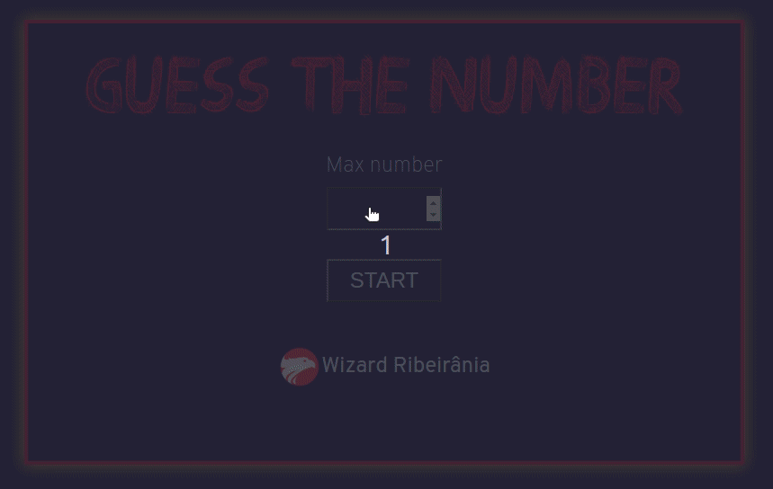

    

  
  
  

___

<h3 align="center">
  <a href="#information_source-overview">Overview</a>&nbsp;|&nbsp;
  <a href="#interrobang-rules">Rules</a>&nbsp;|&nbsp;
  <a href="#interrobang-rules">Rules</a>&nbsp;|&nbsp;
  <a href="#sparkles-result">Result</a>&nbsp;|&nbsp;
</h3>

___

## :information_source: Overview

In this game you must guess the number that computer think of.

## :interrobang: Rules

- Choice de max number and get start
- Try to find the number 
- The computer will tell you if the number is to high or to low
- You have to write de right number to win
- :video_game: [Play](https://wiz-guess-the-number.netlify.app/)

## :sparkles: Result

<h3 align="center">
  
</h3>
