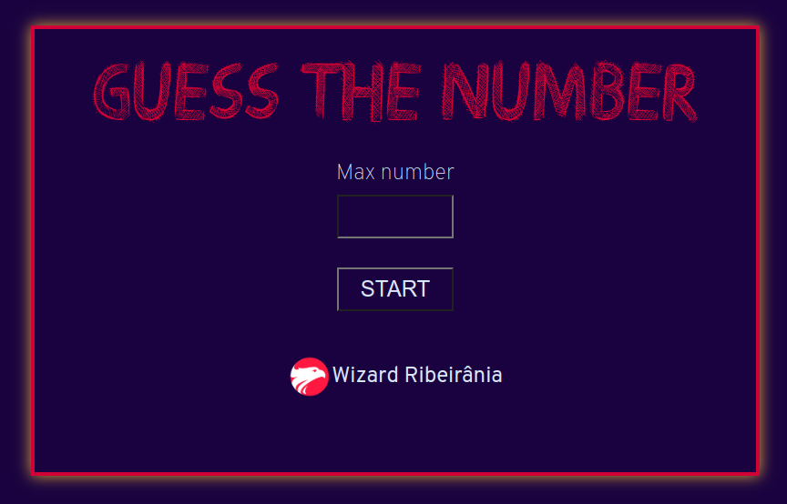

  

  

  
  
  

___

<h3 align="center">
  <a href="#information_source-overview">Overview</a>&nbsp;|&nbsp;
  <a href="#interrobang-rules">Rules</a>&nbsp;|&nbsp;
  <a href="#rocket-tecnologias-utilizadas">Tecnologias</a>&nbsp;|&nbsp;
  <a href="#licença">Licença</a>
</h3>

___

 

## :information_source: Overview

In this game you must guess the number that computer think of.

## :interrobang: Rules

- Try to find the number 
- The computer will tell you if the number is to high or to low
- You have to write de right number to win

## :rocket: Tecnologias Utilizadas 

O projeto foi desenvolvido utilizando as seguintes tecnologias

- HTML5
- CSS3
- Javascript
 

## Licença 

Esse projeto está sob a licença MIT. Veja o arquivo [LICENSE](LICENSE) para mais detalhes.
