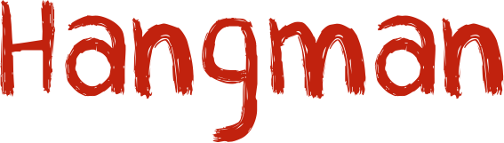
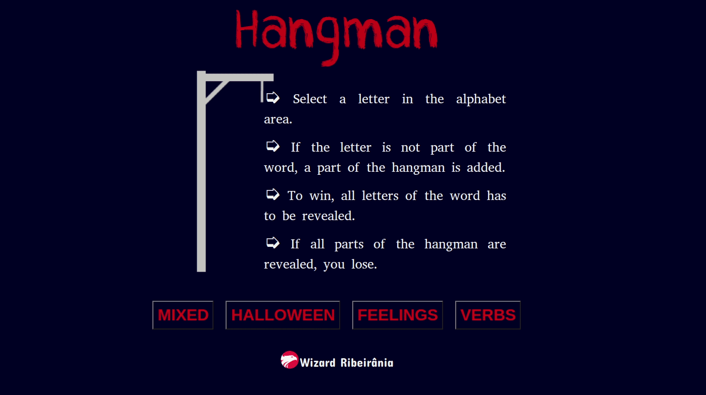

  

  
  
  

___

<h3 align="center">
  <a href="#telescope-overview">Overview</a>&nbsp;|&nbsp;
  <a href="#computer-rules">Rules</a>&nbsp;|&nbsp;
  <a href="#sparkles-result">Result</a>&nbsp;|&nbsp;
</h3>

___

## :telescope: Overview

This is version of the classic letter guessing game called Hangman.

You are shown a set of blank letters that match a word or phrase and you have to guess what these letters are to reveal the hidden word.

## :computer: Rules

- Pick the letter from display.
- If is the wrong letter, the man is draw more and more.
- When the man is completed, the game is over and you lose.
- If you can reveal all the letters in the word before the man is hung then you are successful.
- Good luck!
- :video_game: [Play](https://wiz-hangman.netlify.app/)

## :sparkles: Result

  

