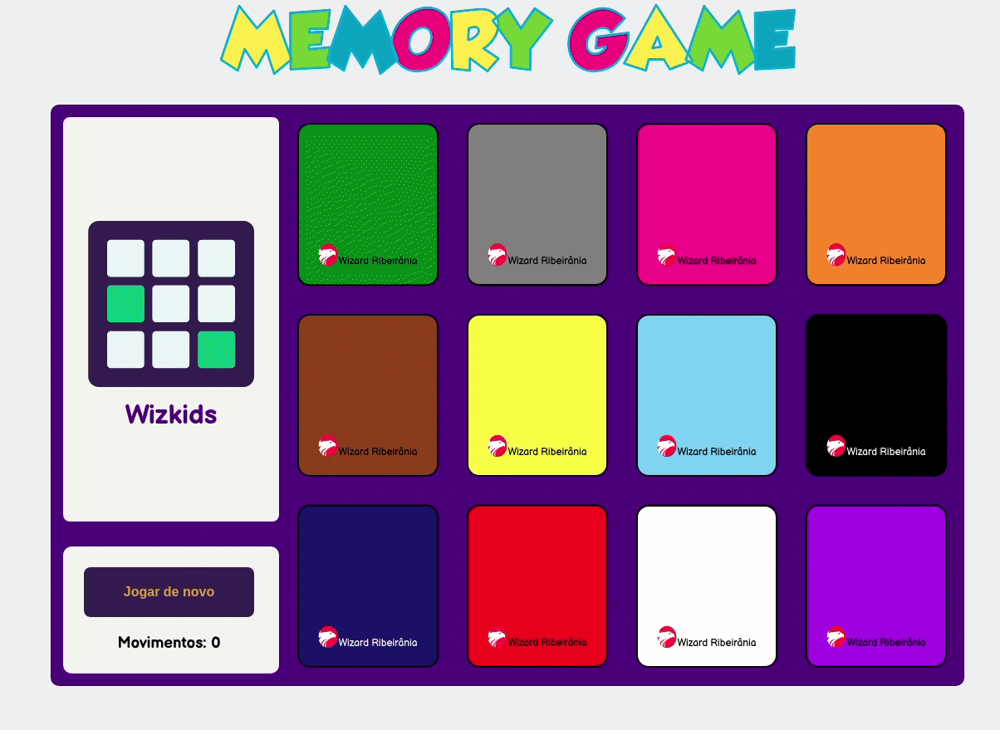

   

  
  
  

___

<h3 align="center">
  <a href="#telescope-overview">Overview</a>&nbsp;|&nbsp;
  <a href="#computer-rules">Rules</a>&nbsp;|&nbsp;
  <a href="#sparkles-result">Result</a>&nbsp;|&nbsp;
</h3>

___

## :telescope: Overview

Memory game for childrens in Tots

 

## :computer: Rules

- Turn over any two cards. 
- If the two cards match, play again. 
- If they don't match, remember what was on each card and where it was.
- Watch and remember during the other player's turn.
- The game is over when all the cards have been matched.
- 🎮 [Play](https://memory-game-wiz.netlify.app/)

## :sparkles: Result

  

