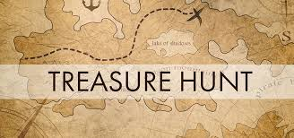
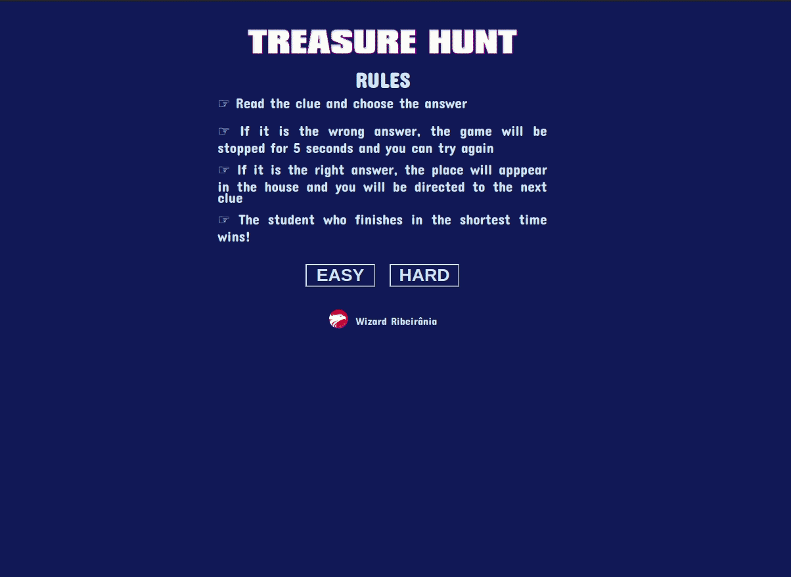

  

  
  
  

___

<h3 align="center">
  <a href="#telescope-overview">Overview</a>&nbsp;|&nbsp;
  <a href="#computer-rules">Rules</a>&nbsp;|&nbsp;
  <a href="#sparkles-result">Result</a>&nbsp;|&nbsp;
</h3>

___

## :telescope: Overview

A treasure hunt is a game where the children have to follow a series of clues to find the correct place.

## :computer: Rules

- Read the clue and choose the answer
- If it is the wrong answer, the game will be stopped for 5 seconds and you can try again
- If it is the right answer, the place will apppear in the house and you will be directed to the next clue
- The student who finishes in the shortest time wins!
- 🎮 [Play](https://wiz-treasure-hunt.netlify.app/)

## :sparkles: Result

  

